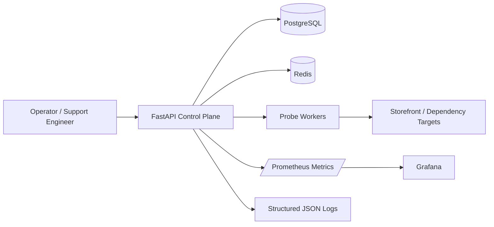

# CloudCart Sentinel

A production-style **e-commerce reliability and data operations platform** built to demonstrate senior-level Linux, AWS, database, API, caching, observability, incident-response, and product-management skills in one cohesive GitHub project.

## Why this project exists

CloudCart Sentinel converts those claims into an inspectable system: a FastAPI service, PostgreSQL data model, Redis caching and rate limiting, asynchronous health checks, Prometheus metrics, structured logging, Docker-based local infrastructure, Terraform for AWS, CI, tests, runbooks, architecture decisions, and a product roadmap.

## Business scenario

An online retailer needs one control plane that can:

- register storefronts and infrastructure dependencies;
- continuously test HTTP, database, cache, and DNS health;
- detect incidents against service-level objectives;
- expose operational metrics and audit history;
- reduce noisy alerts through deduplication;
- give support engineers clear remediation guidance;
- preserve a clean path from local development to AWS.

## Demonstrated skills

| Resume capability | Evidence in this repository |
|---|---|
| Linux and production support | container health checks, Makefile workflows, runbooks, incident model |
| AWS and hybrid cloud | Terraform modules for VPC, ECS/Fargate, RDS, ElastiCache, ALB, CloudWatch |
| MySQL/PostgreSQL/MongoDB/Redis concepts | normalized PostgreSQL schema, repository layer, Redis cache/rate limiting, extension seams |
| High availability and reliability | readiness/liveness probes, retry policy, circuit-safe probes, SLO evaluation |
| Python and API development | typed FastAPI application, Pydantic settings, service/repository separation |
| Automation and CI/CD | GitHub Actions, linting, type checks, tests, container build |
| Monitoring and RCA | Prometheus metrics, correlation IDs, structured logs, runbooks |
| Security and hardening | non-root container, secrets via environment, JWT auth, input validation, least-privilege IAM examples |
| Product management | problem statement, personas, KPIs, roadmap, ADRs, acceptance criteria |

## Architecture



## Quick start

```bash
cp .env.example .env
make up
make migrate
make seed
curl http://localhost:8000/health/live
```

Open:

- API docs: `http://localhost:8000/docs`
- Prometheus: `http://localhost:9090`
- Grafana: `http://localhost:3000` (`admin` / `admin` locally)

## Example API flow

```bash
TOKEN=$(curl -s -X POST http://localhost:8000/api/v1/auth/token \
  -H 'Content-Type: application/json' \
  -d '{"username":"admin","password":"change-me"}' | jq -r .access_token)

curl -X POST http://localhost:8000/api/v1/services \
  -H "Authorization: Bearer $TOKEN" \
  -H 'Content-Type: application/json' \
  -d '{
    "name":"checkout-api",
    "kind":"http",
    "target":"https://example.com",
    "interval_seconds":60,
    "timeout_seconds":5,
    "slo_target":99.9
  }'
```

## Engineering quality gates

```bash
make format
make lint
make typecheck
make test
make test-integration
```

## Repository map

```text
app/                 application code
  api/               HTTP routes and dependencies
  core/              config, auth, logging, telemetry
  db/                SQLAlchemy models and session
  repositories/      persistence abstraction
  services/          business logic and probes
tests/               unit and API tests
infra/terraform/     AWS infrastructure as code
observability/       Prometheus and Grafana provisioning
docs/                architecture, ADRs, product plan, runbooks
.github/workflows/   CI pipeline
```

## Design principles

1. **Operational clarity over cleverness.** Production support engineers must understand failure states quickly.
2. **Typed boundaries.** API, configuration, and persistence contracts are validated.
3. **Replaceable infrastructure.** PostgreSQL and Redis are adapters, not business logic.
4. **Secure defaults.** No embedded production credentials; non-root runtime; short-lived tokens.
5. **Evidence-driven product work.** SLO attainment, MTTR, probe latency, and alert deduplication are measurable.

## Portfolio presentation
## License

MIT. See [LICENSE](LICENSE).
